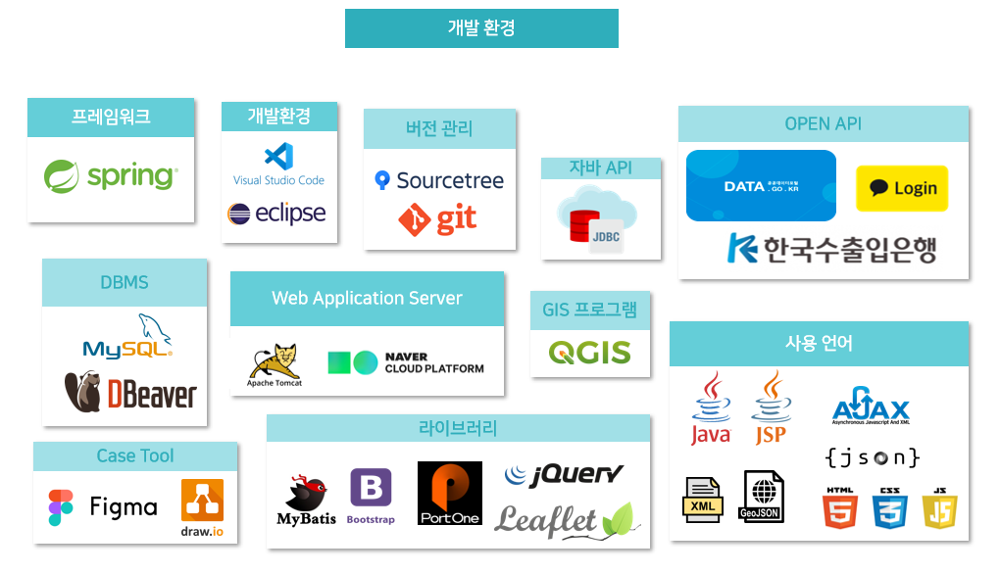
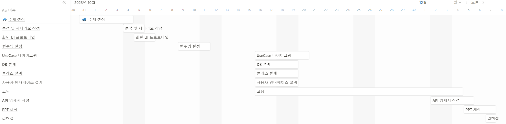

## 🌏 AlerTravel  ( 2023.10.25 ~ 2023.12.08 )

> 'AlerTravel'은 해외 여행 계획 수립 시, 보다 안전하고 원하는 정보를 쉽고 빠르게 얻기 위한 사이트입니다.

 

### 시연 영상
- [서비스 시연 영상](https://youtu.be/d0HqUbfBXVw) 

 

---

## 개발 팀 정보
- 팀명 : Da-win
> **전승민 (PL)** : 여행 경보 페이지 구현, 여행 경보 DB 설계, 회원 관리 기능 구현([@HermitCrapOfLine](https://github.com/HermitCrapOfLine)) 
> **김재원** : 후원하기 페이지 구현, 후원관련 DB 설계, 결제 기능 구현 
> **박예경** : 네비게이션 바 디자인, 디자인 자료 조사 
> **안남기** : 공지사항 페이지 구현, 공지사항 DB 설계, 환율 기능 구현 
> **장지호** : 국가별 정보 DB 관리, ERD 기획 및 관리 
> **하지현** : 메인 화면 지도 구현, 소통게시판 구현, 소통게시판 DB 설계 

  

  ---

## 목차

프로젝트 개요

[프로젝트 개요](#1) 
    [1. 주제 선정 동기](#1.1) 
    [2. 개발 환경 및 사용 기술](#1.2) 
    [3. 프로젝트 진행 일정](#1.3)

서비스 설계

[서비스 설계](#2) 
    [1. 회원 이용 흐름](#2.1) 
    [2. 설계 산출물](#2.2) 
    [3. 서비스 별 기능](#2.3)

---
---

## 프로젝트개요

## 1. 주제 선정 동기
💡 해외여행경보와 여행후기를 한눈에 볼 수 있는 사이트의 필요성

💡 여행후기로는 위험 지역을 포함하여 생생한 경험을 나누고 안전에 대한 경각심을 제고

### 프로젝트 선정 배경
> 해외 여행을 준비하는 여행각들이 많아지면서 여행을 준비하는 국가의 현재 안전 여부를 파악하기에 실제 여행객들의 방문 후기를 모아 제공되는 서비스가 부족하고, 무분별한 광고로 인해 현실적으로 정확하지 않아 용이하지 않습니다. 또한, 여행 국가의 실제 안전경보와 여행객들이 생각하고 있는 안전정보가 일치하지 않는 경우가 많아 여행객들에게 안전에 대한 경각심을 제고하기 위해 "AlerTravel"을 개발하기로 결정하였습니다.   AlerTravel은 전세계 국가의 경보단계를 알려주고, 실제 사용자들간의 소통할 수 있는 서비스를 제공합니다.

### 벤치 마킹 사이트의 한계점

여행경보에 대한 다양한 내용은 있지만 공공기관 사이트 특성상 민원접수를 제외하면 단방향 소통에 그침

## 2. 개발 환경 및 사용 기술

#### Front-end

 

#### Back-end

 

 
 

## 3. 프로젝트 진행 일정

📝 [팀 노션](https://www.notion.so/a74afdd37147457cbea7665aa78032c4?v=ab7196d807424347990406a26bf8d8b7)

---

## 서비스 설계

## 1. 회원 이용 흐름

## 2. 설계 산출물
### E-R Diagram

### 논리 스키마

### Class Diagram

## 3. 서비스별 기능

### ✔ 회원관리 서비스
#### 📍회원가입
대상 : 일반회원, 점주회원
이메일, 비밀번호, 비밀번호 확인, 이름, 거주지, 전화번호, 회원유형 입력
#### 📍회원 탈퇴
대상 : 일반회원, 점주회원
비밀번호 입력을 통한 본인 확인 후 회원 탈퇴 가능
#### 📍회원정보 수정
대상 : 일반회원, 점주회원
비밀번호 인증 후 개인 정보 수정 가능 -> 이메일, 회원유형 수정 불가
#### 📍마이페이지
대상 : 일반회원, 점주회원
기존에 입력했던 정보 확인과 수정 가능
#### 📍로그인/로그아웃
대상 : 일반회원, 점주회원
기존에 가입했던 이메일과 비밀번호를 통해 로그인
#### 📍비밀번호 찾기
대상 : 일반회원, 점주회원
이메일로 임시 비밀번호 발급받기

---

### ✔ 위치기반 검색 서비스
#### 📍검색 기준위치 변경
대상 : 일반회원
사용자가 검색 기준을 변경하여 해당 위치에 대한 매장 검색 가능
##### 📍카테고리별 지도보기
대상 : 일반회원
매장 카테고리별로 원하는 카테고리 선택후 매장 검색 가능

---

### ✔ 매장 서비스 (점주/일반)

---

### ✔ 메뉴 서비스 (점주/일반)

---

### ✔ 장바구니 주문 결제 서비스 (일반)

---

### ✔ 리뷰 / 문의 / 관리자 서비스 

---

